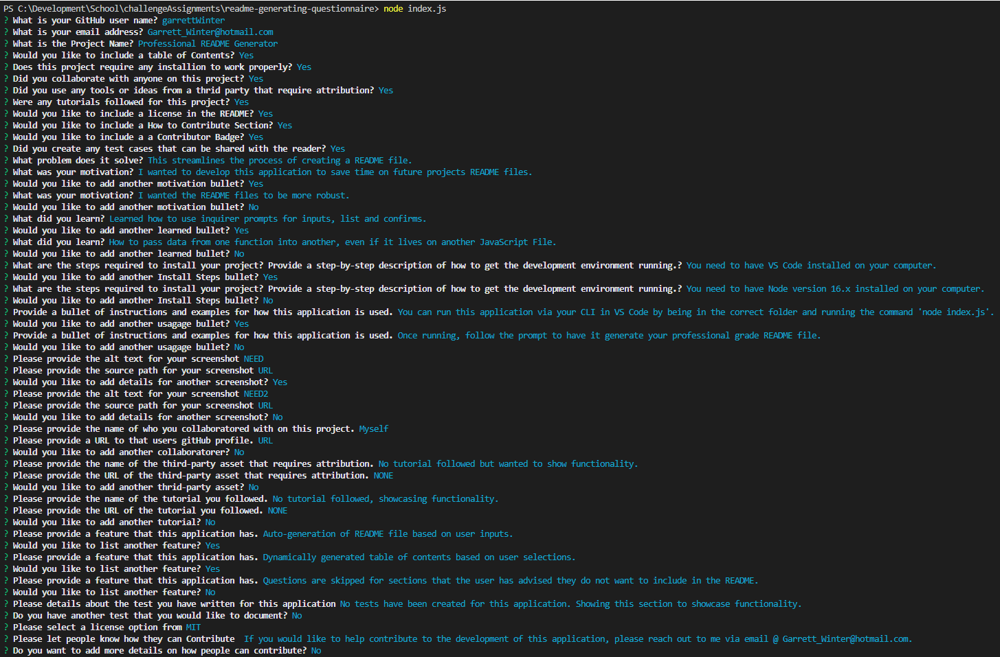
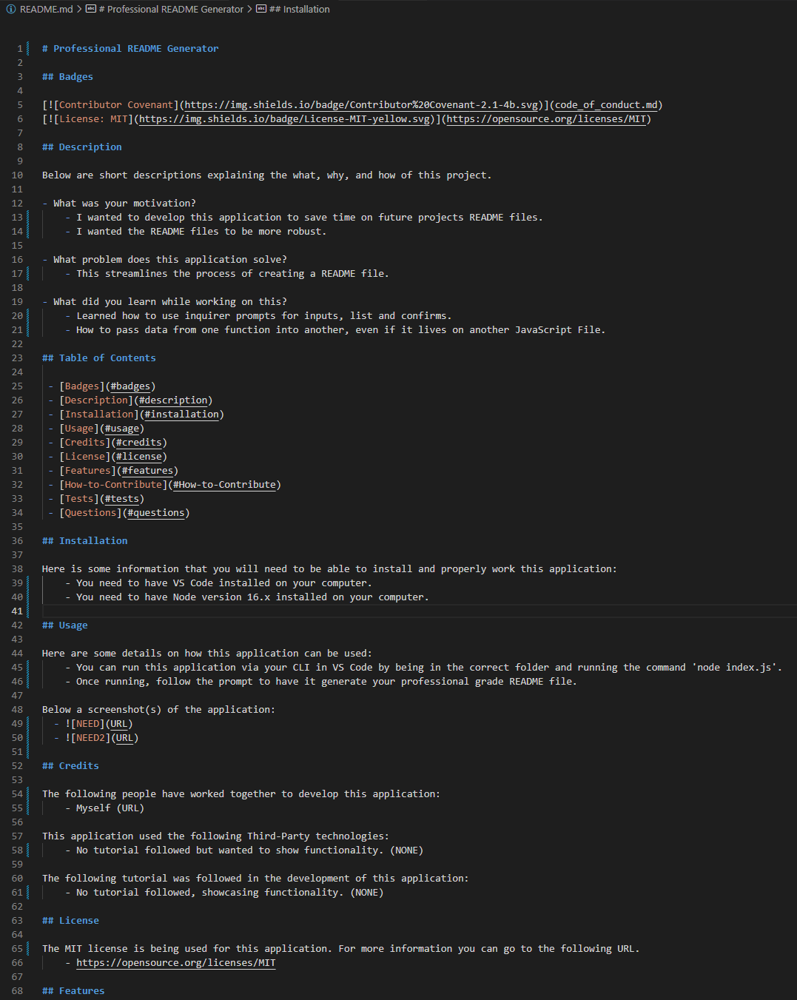

# README Generating Questionnair

## Badges

## Description

Below are short descriptions explaining the what, why, and how of this project.

- What was your motivation?
    - I wanted to develop this application to save time on future projects README files.
    - I wanted the README files to be more robust.

- What problem does this application solve?
    - This streamlines the process of creating a README file.

- What did you learn while working on this?
    - Learned how to use inquirer prompts for inputs, list and confirms.
    - How to pass data from one function into another, even if it lives on another JavaScript File.
  
## Table of Contents

 - [Badges](#badges)
 - [Description](#description)
 - [Installation](#installation)
 - [Usage](#usage)
 - [Credits](#credits)
 - [License](#license)
 - [Features](#features)
 - [How-to-Contribute](#How-to-Contribute)
 - [Tests](#tests)
 - [Questions](#questions)

## Installation
  
Here is some information that you will need to be able to install and properly work this application:
    - You need to have VS Code installed on your computer.
    - You need to have Node version 16.x installed on your computer.

## Usage
  
Here are some details on how this application can be used:
    - You can run this application via your CLI in VS Code by being in the correct folder and running the command 'node index.js'.
    - Once running, follow the prompt to have it generate your professional grade README file.
      
Below a screenshot(s) of the application:
  - 
  - 
  - 

## Credits

The following people have worked together to develop this application:
    - Garrett Winter (https://github.com/garrettWinter)

This application used the following Third-Party technologies:
    - No third parties followed but wanted to show functionality. (None Used)

The following tutorial was followed in the development of this application:
    - No tutorial followed, showcasing functionality. (None Followed)
  
## License

The MIT license is being used for this application. For more information you can go to the following URL.
    - https://opensource.org/licenses/MIT

## Features

Some of the main features of this application are:
    - Auto-generation of README file based on user inputs.
    - Dynamically generated table of contents based on user selections.
    - Questions are skipped for sections that the user has advised they do not want to include in the README.

## How to Contribute
  
Here are some details on how to contribute to this application:
    - If you would like to help contribute to the development of this application, please reach out to me via email @ Garrett_Winter@hotmail.com.

## Tests
  
Test have been written for this application to aid in the development process. Below is some details on how to use these test cases:
    - No tests have been created for this application. Showing this section to showcase functionality.

## Questions

Below is my gitHub user name:
  - garrettWinter

If you have questions and would like to discuss you can reach out to:
  - Garrett_Winter@hotmail.com
